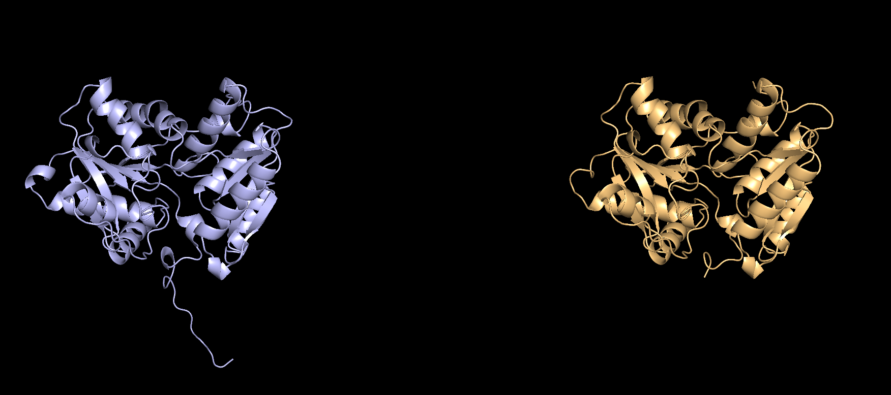

# Оценка качества прогнозирования структуры белка с использованием сверточных графовых нейронных сетей
***************
Репозиторий для НИР
--------
Научный руководитель [В.В. Стрижов](http://www.ccas.ru/strijov/)

[Актуальная версия отчета](https://github.com/severilov/Graph-nets-for-CASP/blob/master/report/Severilov2019NIR.pdf)

pip3 install -r requirements.txt 

